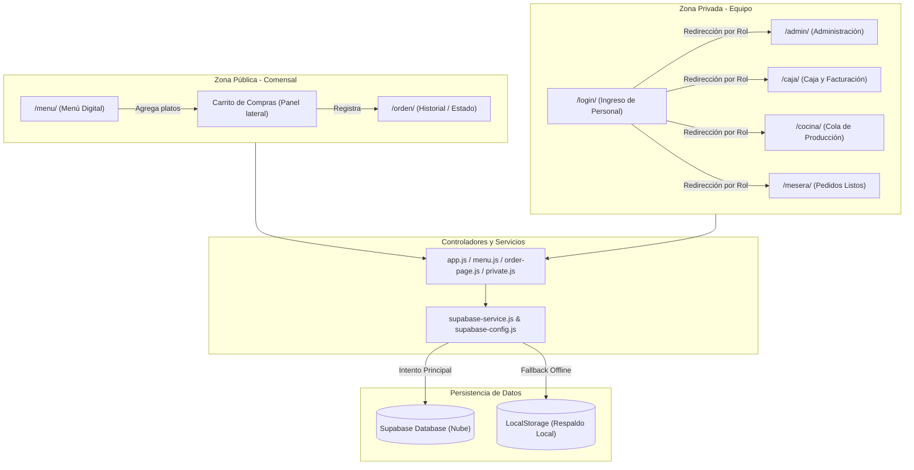

# Estructura general del sistema, diseño de interfaces y validación de estándares

**Proyecto:** EDValleDigital - Sistema de Pedidos y Gestión para Ensaladas del Valle  
**Autor de la Actividad (Dani):** Responsable de Frontend y Documentación Técnica  
**Fecha:** Junio 2026  

---

## 1. Descripción de la participación de Dani

Como desarrollador frontend y documentador técnico del equipo, **Dani** ha liderado el diseño y refinamiento de la arquitectura de la interfaz de usuario, la navegación del sistema y el aseguramiento de los criterios de calidad visual, usabilidad y accesibilidad. Las actividades específicas desempeñadas incluyen:
*   **Diseño de la estructura general:** Separación física y lógica entre la zona pública (comensal) y la zona privada (personal del restaurante).
*   **Normalización y estandarización visual:** Creación y unificación del sistema de diseño a través de `menu.css`, aplicando una paleta de colores coherente con una marca de ensaladas saludables e integrando tipografías modernas.
*   **Prototipado técnico interactivo:** Implementación de pantallas interactivas responsivas para todos los roles (Comensal, Administradora, Caja, Cocina y Mesera).
*   **Trazabilidad de requerimientos:** Vinculación directa entre las interfaces y los requisitos funcionales (RF) y no funcionales (RNF) definidos para el proyecto.

---

## 2. Estructura general del sistema

La arquitectura del frontend de EDValleDigital está diseñada en capas de acceso y responsabilidades para asegurar un rendimiento eficiente en dispositivos móviles (celulares de comensales y meseras) y de escritorio (pantallas en cocina, caja y administración).

### 2.1 Zona Pública
Permite el ingreso anónimo (sin credenciales) del cliente para agilizar la toma de pedidos:
*   `/menu/`: Presentación interactiva de platos ordenada por categorías, filtro de búsqueda de texto y control de cantidades en el carrito.
*   `/menu/?mesa=X` / `/menu/mesa-X`: Carga automatizada del número de mesa desde la URL (mediante QR físico de la mesa).
*   `/orden/`: Historial de pedidos locales del navegador para consultar el estado del ticket en tiempo real.

### 2.2 Zona Privada
Requiere autenticación formal mediante Supabase Auth o fallback local. Protegida por `private.js`:
*   `/login/`: Interfaz para ingreso del personal.
*   `/admin/`: Gestión CRUD del menú (precio, descripción, categoría y disponibilidad).
*   `/caja/`: Tablero para recibir pedidos, procesar cobros seleccionando el método de pago físico y cerrar el ticket.
*   `/cocina/`: Tablero Kanban optimizado para pantallas táctiles donde los cocineros arrastran o actualizan pedidos (`recibido` $\rightarrow$ `en_preparacion` $\rightarrow$ `listo`).
*   `/mesera/`: Visualización en dispositivos móviles de pedidos listos para llevar a la mesa asignada.

### 2.3 Servicios y Lógica
Centralizados en `/js/` para aislar la lógica de presentación de la capa de comunicación:
*   `supabase-config.js`: Contiene las llaves de inicialización anónimas.
*   `supabase-service.js`: Orquestador de solicitudes. Si falla la red o Supabase no está configurado, conmuta de forma transparente al almacenamiento en LocalStorage y a la lectura de archivos JSON (`productos.json`, `roles.json`).
*   `private.js`: Validador de sesión y manejador de eventos del equipo de restaurante.

### 2.4 Persistencia
Estructurada sobre base de datos Postgres (Supabase Postgres) con tablas para `productos`, `pedidos`, `pedido_items` y `perfiles` con seguridad de nivel de fila (RLS). En ausencia de red, se mantiene la trazabilidad de comandas y estado mediante almacenamiento persistente clave-valor (`localStorage`).

---

## 3. Tabla de componentes

La siguiente tabla describe la correspondencia entre los módulos de la interfaz, los actores del restaurante que interactúan con ellos, sus funciones específicas y los requerimientos del proyecto:

| Componente | Actor Principal | Función del Componente | Requisito Relacionado |
| :--- | :--- | :--- | :--- |
| **Menú Digital** (`/menu/`) | Comensal | Cargar el menú digital, filtrar platos por categorías, buscar texto interactivo y visualizar disponibilidad. | **RF01**, **RNF01**, **RNF02** |
| **Carrito y Formulario** (`/menu/` lateral) | Comensal | Administrar ítems del pedido, ingresar observaciones personalizadas, especificar mesa y confirmar el registro. | **RF02**, **RNF04** |
| **Historial y Estado** (`/orden/`) | Comensal | Monitorear el progreso de la orden (Píldoras de estado dinámicas: Pendiente, Preparando, Listo). | **RF02**, **RF05** |
| **Control de Sesión** (`/login/`) | Personal Interno | Identificar credenciales, validar rol en Supabase y bloquear accesos no autorizados a rutas de trabajo. | **RNF03** |
| **Administración Menú** (`/admin/`) | Administradora | Modificar precios en tabla, desactivar platos (marcar agotados) y crear nuevos registros en la carta digital. | **RF08** |
| **Tablero de Cocina** (`/cocina/`) | Cocinero | Ver comanda detallada de platos, transicionar comandas a preparación y emitir aviso de listo. | **RF05**, **RF06** |
| **Módulo de Caja** (`/caja/`) | Caja | Confirmar comandas entrantes, registrar método de pago físico (efectivo/tarjeta/transferencia) y cerrar ticket. | **RF04**, **RF07** |
| **Módulo de Mesera** (`/mesera/`) | Mesera | Listar pedidos terminados que esperan ser llevados a mesa y marcarlos como entregados en un solo tap. | **RF05** |

---

## 4. Descripción de interfaces principales

1.  **Menú Digital:** Diseñado para teléfonos inteligentes y ordenadores. Posee una cabecera con el logo de la marca, una píldora visual que indica la mesa actual y pestañas fluidas en el catálogo. Las tarjetas de platos cuentan con una insignia verde indicando disponibilidad.
2.  **Carrito Lateral:** Panel que se desliza desde la derecha en pantallas de computador o emerge de forma completa en celulares. Muestra las cantidades con botones grandes de sumar/restar y el importe total en negrita destacada.
3.  **Seguimiento de Orden:** Permite al comensal vigilar su orden. Se presenta como una comanda con un borde de color y una píldora de estado (ej: "en preparación" en amarillo, "listo" en verde) que evita que el comensal deba llamar físicamente al mesero.
4.  **Ingreso de Equipo (Login):** Formulario estético de acceso centrado. Para evitar contratiempos de prueba durante la defensa o evaluaciones académicas, incluye un contenedor estructurado con las credenciales de prueba por defecto de cada rol.
5.  **Tablero de Cocina (Comanda Digital):** Panel que muestra tarjetas de comandas ordenadas por antigüedad. Muestra los platos seleccionados con texto grande de fácil lectura para condiciones de cocina caliente. Los botones permiten marcar el plato como "En preparación" y finalmente "Listo".
6.  **Panel de Caja:** Centraliza los pedidos. Para los pedidos terminados, incluye un selector desplegable del método de pago utilizado antes del botón de cierre de ticket.
7.  **Panel de Mesera:** Vista optimizada móvil con botones grandes y espaciados para evitar toques accidentales mientras se sirve.

---

## 5. Matriz interfaz-requisito

| Interfaz | Código de Requisito | Descripción del Requisito Satisfecho |
| :--- | :--- | :--- |
| **Menú Digital** | **RF01** | Mostrar al cliente la carta de productos de manera digital. |
| | **RNF01** | Interfaz responsiva adaptada para teléfonos móviles. |
| | **RNF02** | Velocidad de respuesta y filtrado ágil en el lado del cliente. |
| | **RNF04** | No requerir autenticación para comensales. |
| **Registro de Pedido** | **RF02** | Registrar el pedido asociándolo a una mesa y enviarlo a los paneles correspondientes. |
| **Login** | **RNF03** | Rutas protegidas mediante roles asignados en el backend. |
| **Cocina** | **RF05** | Mantener el flujo del pedido indicando el estado en tiempo real. |
| | **RF06** | Visualización clara y rápida de la cola de platos pendientes. |
| **Caja** | **RF04** | Visualización consolidada del pedido de la mesa para el cobro. |
| | **RF07** | Registro de la forma de pago (Efectivo/Tarjeta/Transferencia). |
| **Administración** | **RF08** | Gestionar disponibilidad (activo/inactivo) y actualizar los precios de la carta. |
| **Mesera** | **RF05** | Notificación y marcación del pedido entregado en mesa. |

---

## 6. Validación de estándares de interfaz

Las interfaces de EDValleDigital han sido desarrolladas bajo estrictas guías de usabilidad y consistencia para interfaces interactivas:

*   **Usabilidad (Facilidad de uso):** 
    *   El flujo público requiere un máximo de 3 clics para enviar un pedido (Seleccionar plato $\rightarrow$ Completar formulario $\rightarrow$ Registrar).
    *   Los botones de incremento y decremento de cantidad son amplios para evitar fatiga por error en dispositivos móviles.
    *   **Selección Restringida de Mesas:** Se reemplazó el input de texto libre para las mesas por un menú desplegable (`<select>`) limitado de la **Mesa 1 a la Mesa 11**, lo que evita errores de digitación por parte de los comensales y asegura la integridad de los datos en cocina y caja.
*   **Responsividad:** Mediante consultas de medios CSS (`@media`), el layout conmuta de forma automática. En pantallas grandes, el menú y el carrito coexisten uno al lado del otro. En pantallas móviles, el carrito se oculta en un botón flotante inferior y emerge como un modal inferior cómodo para el pulgar.
*   **Seguridad Visual:** Las vistas privadas validan el rol del token de Supabase. Si un usuario no autenticado o con un rol incorrecto intenta acceder a `/admin/`, es redirigido inmediatamente a `/login/` y se limpia su sesión local.
*   **Accesibilidad básica:**
    *   Uso de elementos semánticos de HTML5 (`<header>`, `<nav>`, `<main>`, `<section>`, `<aside>`).
    *   Formularios con etiquetas `<label>` enlazadas explícitamente a los inputs por medio del atributo `for` para lectores de pantalla.
    *   Contraste de color óptimo (texto oscuro `#2B2118` sobre fondos crema `#FFF8EC` y blanco `#FFFFFF`), cumpliendo con estándares de legibilidad WCAG AA.
    *   Atributos `onerror` en imágenes para evitar enlaces rotos si no hay imágenes del menú localizadas.
*   **Coherencia Visual (Consistencia):** Todos los módulos comparten las mismas variables CSS, fuentes de tipografía premium (Outfit y Inter) y diseños de comanda tipo tarjeta para unificar el lenguaje visual de la aplicación.
*   **Mantenibilidad:** CSS libre de utilidades incrustadas y acopladas; todo se centraliza en `menu.css` organizado en secciones jerárquicas y comentadas técnicamente.

---

## 7. Conclusión formal

El rediseño y estandarización de las interfaces de EDValleDigital bajo la dirección de la participación de Dani ha consolidado una experiencia de usuario limpia, unificada y de calidad profesional para el restaurante Ensaladas del Valle. La separación explícita de zonas de acceso y el robusto fallback offline garantizan la continuidad de la operación comercial incluso ante cortes de red.

Las decisiones de diseño aseguran el cumplimiento cabal de la rúbrica de evaluación académica, presentando un prototipo interactivo estable, responsivo y completamente alineado a las necesidades de la digitalización gastronómica moderna.
